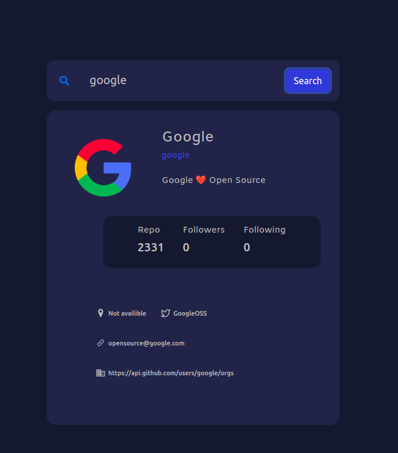
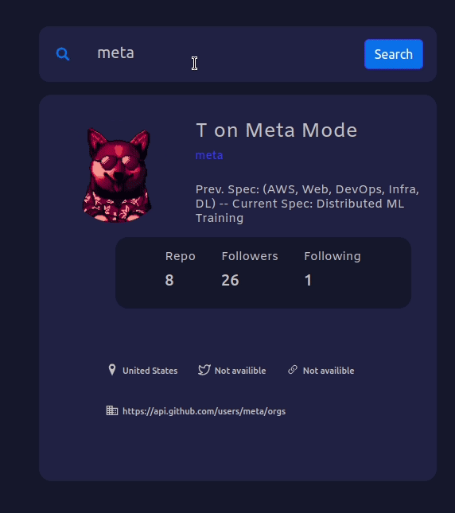
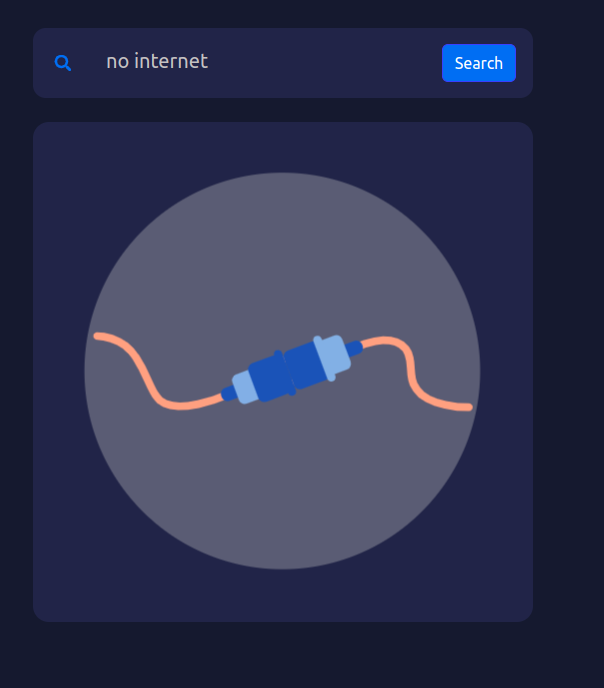
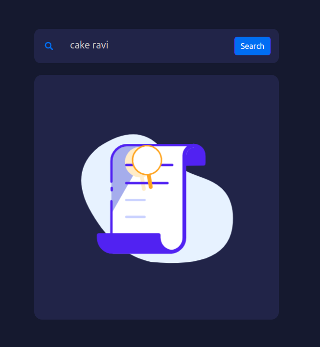

# Github Search Application


## How to Use Github Search REST Api

### steps

&rarr; first create a pat(personal access token) from github

&rarr; then use them with your username treat token as your password

&rarr; url to get user details

```js
    https://api.github.com/search/users?q=ms0483

    //other way to get data
    //using this url

    https://api.github.com/users/{username}

    //here ms0483 is the username query

```

```js
//eg how to use cred with axios for calling

axios.get('https://api.github.com/search/users?q=ms0483',{
  auth:{
    username:'username',
    password:'pat'
  }
}).then((response)=>{
  console.log(response);
}).catch((err)=>{
  console.log(err);
})

```

```js
Ref:/home/user/Desktop/react-project/github-app

```

## How to use lottie-web for animation

### steps

&rarr; install lottie-web

&rarr; create component

&rarr;pic the animation from lottie website

&rarr; 
```js

//in component

import { useEffect,useRef } from "react";
import { useGlobalContext } from "../context/Context";
import lottie from "lottie-web";
import loadingLogo from "../images/loading.json";


const Loading = () => {
    const {isLoading}=useGlobalContext();
    const container=useRef(null);

    useEffect(()=>{
        if(container.current){
            const inst=lottie.loadAnimation({
                container:container.current,
                renderer:'svg',
                autoplay: true,
                animationData:loadingLogo
            });
        
            return ()=>inst.destroy();
        }
    },[isLoading])

        return (
            <section>
                <div className="loading" ref={container}>
                </div>
            </section>
  
        );
    
}
 
export default Loading;

```


## Working of Application

<div>


&rarr;Normal data tab





&rarr; Loading  component




&rarr;No internet component





&rarr; No data found tab




</div>


